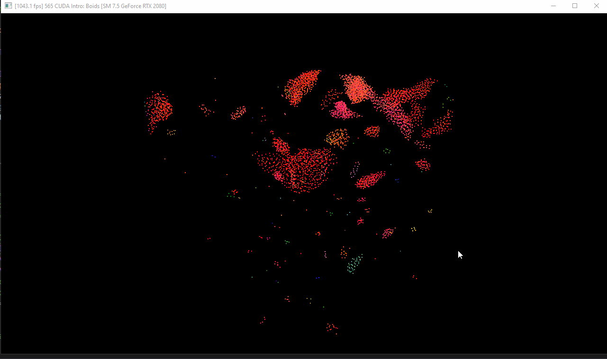
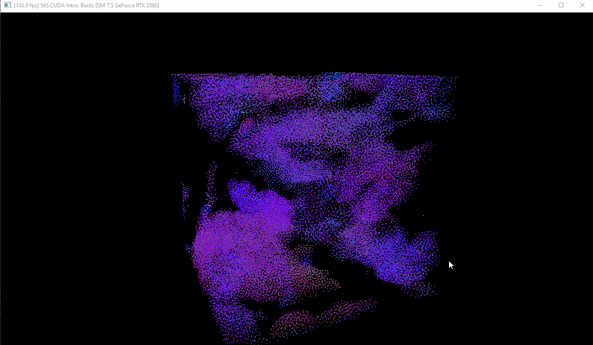
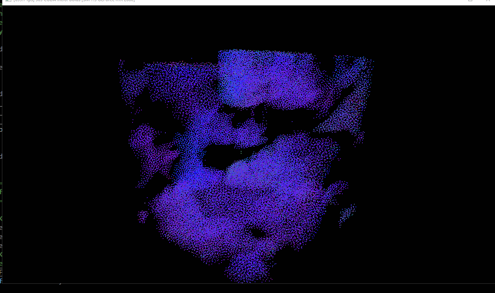
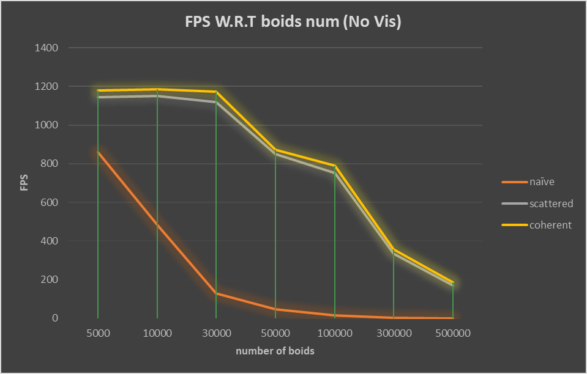
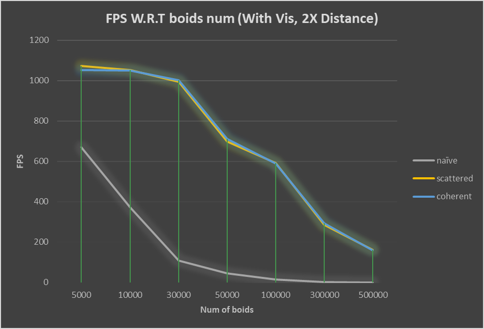
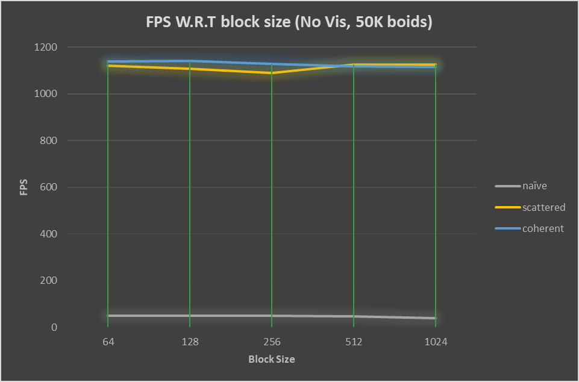
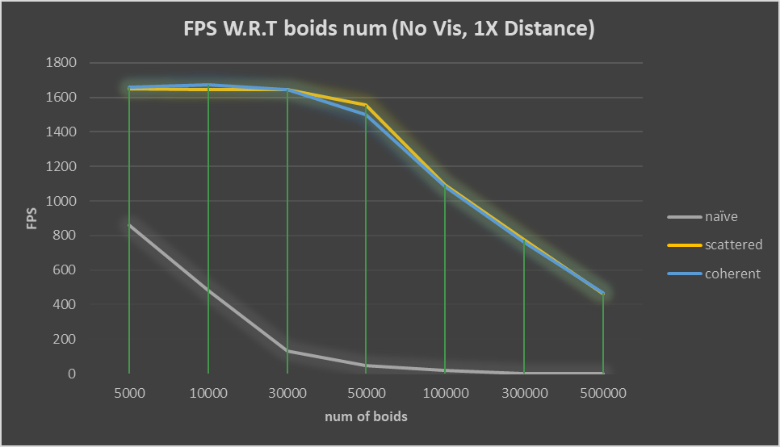
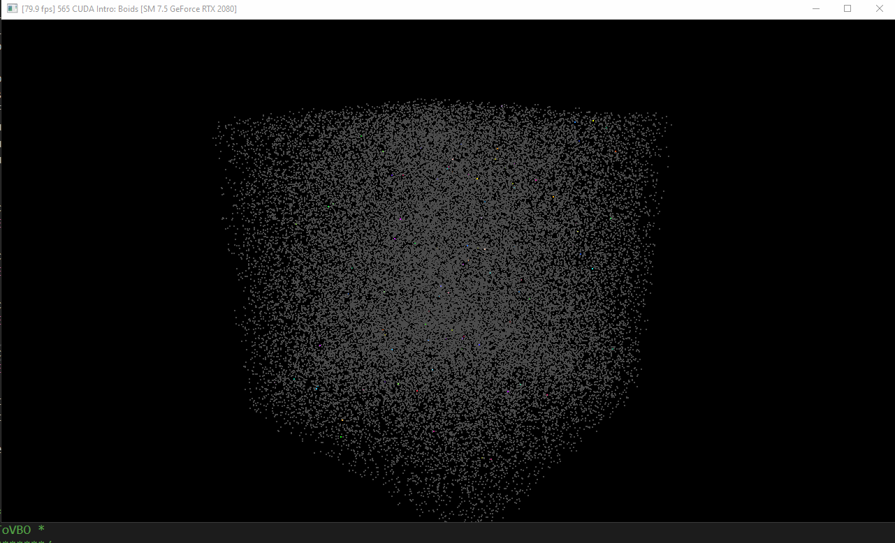
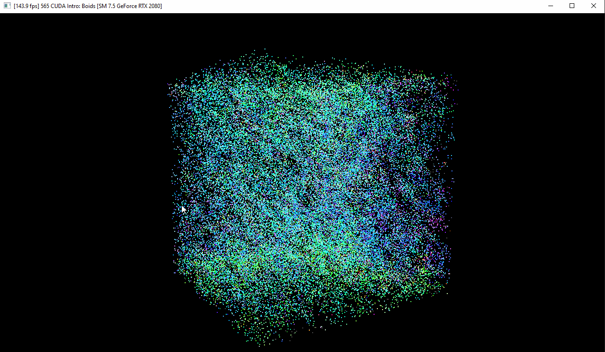

**University of Pennsylvania, CIS 565: GPU Programming and Architecture,
Project 1 - Flocking**

#### Author information

* Tianming Xu (Mark)
  - www.linkedin.com/in/tianming-xu-8bb81816a (LinkedIn)
* Tested on: Windows 10, i7-8700 @ 3.20GHz 16GB, GTX 2080 8192MB (my personal desktop)

### Boids Screenshots

##### 5,000 boids

##### 50,000 boids(without turning off the vertical sync)

##### 50,000 boids(uniform grid)

### Performance Analysis

I collected four different types of performance data to be used to compare: 1) FPS vs boids number(no visualization, 2x neighbor distance). 2)FPS vs boids number(with visualization, 2x neighbor distance). 3) FPS with block size with fixed amount of boids 4) FPS vs boids number(no visualization, 1x neighbor distance).

#### FPS vs boids number(no visualization, 2x neighbor distance)

* In the naive implementation, the performance(fps) drops significantly when we increase the size of boids number. I can tell it is very like the y = 1 / x^2 graph which is expected, as we use n_object ^ 2 to update the velocity in naive implementation.
* Comparing to the naive implementation, the scattered grid implementation has a very good performance in the beginning stage. In each frame, we need to do the preprocessing part(parsing indices, identifying start and end), which are multiple linear(n) operations. With those preprocessing functions' help, we can do the update in almost linear time. (the number of cell we need to test is at most 8, which is a constant) Hence, it is expected that, it will be better than naive.
* Coherent uniform grid implementation is not a much difference with the scattered uniform grid one. The reason I guess is that I am using RTX 2080 with 8 GB memory, for each block, it might be able to store all information we need to update the velocity. Hence, it doesn't quite affect the performance.

#### FPS vs boids number(with visualization, 2x neighbor distance)

The trend of this chart is similar to no vis one. However, we can see that all three implementations perform worse comparing to no vis one. This is reasonable because it is also GPU's work to draw the pixel to corresponding color on the display screen. Hence, some parts of the GPU are doing drawing work, which means that they can't help the calculation.

#### FPS with block size with fixed amount of boids

We can conclude that block size doesn't have a big impact on the performance, which can be derived from this chart. I think this is expected, the wrap size is 32, and if we use the multiple of 32, then we fully utilize all the threads in each block in one time. Hence, the performance shouldn't be a big change. However, there is a little wave in scattered implementation. But I don't have any idea why there is a sudden drop of performance there.

#### FPS vs boids number(no visualization, 1x neighbor distance)

I want to put the No vis, 2x distance chart again here as a comparison

It is very surprised to me that the performance of changing the neighbor distance from 2X to 1X to make nearly 200 - 400 fps difference. (not including naive, which isn't affected by that)

Intuitively, I expected a drop in performance instead of an increment. However, I think it makes sense after I think about it for a while. First of all, I want to mention that I "limit the search area based on the grid cells that have any aspect of them within the max_distance".  Apparently, if we decrease the size of cell, the number of boids in each cell also decrease. Hence, if most of the boids are not on the corner of cell, they might only need to search a limit number of cells and avoid many unnecessary "corner cells" comparing to using the hard-coded value to do the search. Therefore, the performance increases.

### Debug Database

This part is used to note down some typical bugs I met during the implementation process. 

* **Remember to allocate the memory for your buffer pointers**. And when you do that, make sure the type you allocate is correct. --- otherwise, it crashes.
* **Index naming is very very important**. Two of my very tough bugs are because of that. One of the bug is that only few of points are moving. Finally, I found out that I directly used the loop index to be used as the boid index. So definitely it is not correct. (I used boid_index at the bgeinning as the loop index, which is very easy to be misunderstood) The second bug is that the movement of particles are very chaos, not grouping together. Finally I found out that I used the thread index instead of the current looped boid index to update my rule3 component. So when strange thing happened. **Don't forget to double-check all the indices you use and make sure they are right**.
  * gif of only very few boids are moving
  * 
* **Every help function is useful**. I met a problem that my scattered uniform grid implementation had a lower FPS at first than naive method. I didn't use  kernResetIntBuffer at that time. However, I thought again and understand why do we need that: we need a way to notify the kernel which cell doesn't have any boid in it! Otherwise, we can't skip that cell and waste many time on computing an empty cell (it is lucky it didn't crash...)

### Extra works and Comments

##### Extra works:

- Thanks to the very clear explanation on the instruction and Hanna's readme, I directly use the "dynamic search area" method to get the minimum and maximum index of the cell we need to search for determining the velocity of a specific boid. This is very handy when you want to test the 27 and 8 comparison because I only need to change a factor to control the cell width.
- (Collaboration with Gangzheng Tong) I and Gangzheng Tong actually make an automation to generate and store the performance data in a .txt file without a need to recompile the program. It is handy when you need to collect tons of data in different situations. We change the CMakeList to add a helper header: cxxopts.hpp and add a new mainloop to main.cpp. We will turn off the automation in the submission version of code. But if anyone want to use it, you can turn on the automation macro in main.cpp and follow the instruction we added to the repo.

### Unsolved Problems

There are actually two unsolved problems in this project due to the very close due date.

- Can't compute the min and max index of cell we need to search for updating the velocity of a boid individually based on each coordinate. The result will be wrong comparing to use the whole 3 coordinates in a vec3 to do the calculation and assign to each variable.  Here is a gif of how it looks like if you compute the min and max individually. 
  - 
  - The code of this implementation is commented out in line 502-513. Hope someone can find out the reasons if anyone is interested in.
- Crash when the number of boids is more than 500k. The thrust functions have some problems when the number of boids exceed 500k. Here is a screenshot
  - 

### Acknowledgements

I really want to thank Hanna and Gangzheng Tong for this project. Hanna's explanation in her readme is fantastic and help me a lot when I implemented the whole project, especially part 2. 

Gangzheng Tong and I worked on an automation to collect tons of performance data in a short amount of time and no need to worry the recompilation in each performance test, which helps me a lot to hand the submission on time.